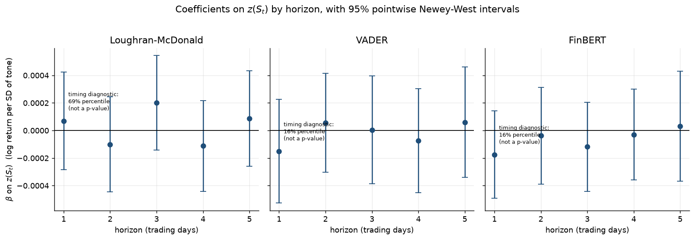

# news-sentiment-signal

**Does FinBERT's classification skill survive as a market signal?**

A domain transformer reads financial sentences far better than a word counter. That is a
measurement fact, and it is easy to demonstrate. Whether that better measurement turns into a
*tradeable* one is a different question with a much heavier evidentiary burden — and this project
asks both, in that order, with the statistical machinery the second question actually requires.

> **Status: scaffold.** The build specification is complete and frozen
> ([`docs/implementation-plan.md`](docs/implementation-plan.md)); `src/` is implemented against it;
> the look-ahead firewall tests pass. Two decisions are still open by design — the news dataset (D1)
> and the sample window (D4) — and are locked by the Stage 0 audit in
> `notebooks/01_data_audit.ipynb`. Findings below are filled in from `run_all.py` output, not before.

---

## The two acts

**Act 1 — validation.** On labeled financial sentences (Financial PhraseBank), how much better does
FinBERT classify sentiment than a general-purpose lexicon (VADER) and a domain lexicon
(Loughran–McDonald)? The three scorers form a ladder — generic lexicon → domain lexicon → domain
transformer — so the gain splits into *domain vocabulary matters* and *context matters beyond
vocabulary*.

**Act 2 — signal.** Is daily aggregate headline sentiment associated with same-day SPY returns?
Does it *predict* next-day returns once standard errors are HAC-corrected, the lag family is
FDR-controlled, and the result is checked against a block-permutation placebo? And does it predict
next-day volatility and volume — the outcomes where media-sentiment effects are documented?

**The bridge.** Sentiment scores are noisy measurements of a latent quantity. Classical
errors-in-variables attenuates a coefficient toward zero in proportion to measurement noise. So
Act 1's answer makes a *testable prediction* about Act 2: on an identical specification, the better
classifier should produce a larger, better-determined coefficient. That prediction is tested, not
assumed.

## Findings

<!-- Filled in at Stage 7 from report/tables/. Three bullets, no more. -->

1. _(Act 1)_ FinBERT exceeds Loughran–McDonald by **X** macro-F1 points on the ≥75%-agreement
   PhraseBank subset (McNemar p = …); the VADER→LM step contributes **Y** of the total gain.
2. _(Act 2)_ Same-day association: … . Next-day prediction: … after BH-FDR across five horizons and
   a block-permutation placebo.
3. _(Act 2)_ Effect sizes larger than **Z bps per 1σ** of sentiment are ruled out at 95% — against a
   ~5 bps one-way transaction-cost bar.



## Reproduce

```bash
pip install -r requirements.txt
python data/raw/download.py --all   # news dump, SPY/^VIX; the LM dictionary by hand
python rescore.py                   # once: the FinBERT pass, cached by headline hash
python run_all.py                   # minutes, no GPU: panel -> every table and figure
pytest                              # the firewall
```

`rescore.py` is deliberately **not** part of `run_all.py`. FinBERT inference over the full headline
set is the only expensive step in the project; scores are cached keyed on headline hash, so the
command a reader actually runs takes minutes and needs no GPU.

## Two properties of the design

**One analysis table.** Every Act-2 number comes from `data/processed/daily_panel.parquet`. If a
result is wrong, it is wrong in the panel or in the regression — never in an ad-hoc join inside a
notebook. Notebooks contain no analysis logic: they import from `src/`, call, and display.

**One firewall.** [`tests/test_alignment.py`](tests/test_alignment.py) is where look-ahead bias goes
to die. The timestamp→trading-day rule (D6: a headline stamped *s* belongs to day *t* iff
*s* ∈ (close(t−1), close(t)], close = 16:00 ET) is implemented in exactly one function, every
forward-looking column is created by exactly one shift, and the tests assert 15:59 → *t*,
16:01 → *t+1*, Saturday → Monday, holiday → next session, and — the one that matters — that no row
of the panel at date *t* was built from a headline that postdates close(*t*). These run on a
synthetic calendar with no dataset present, which is the point: the firewall must be checkable
before there is any data to be wrong about.

## Repo map

```
config.py            every locked decision (D1–D16) from the plan; imported everywhere
run_all.py           panel -> Tables 2-5, Figures 2-4
rescore.py           the one-off FinBERT pass (--time-only times it first)
src/data.py          news load, dedup (exact + near-duplicate), SPY/^VIX, NYSE calendar
src/scoring.py       LM | VADER | FinBERT, behind one Scorer protocol; hash-keyed cache
src/align.py         D6 timestamp rule, daily aggregation, the panel, the single shift
src/validate.py      Act 1: threshold fit, macro-F1, exact McNemar
src/inference.py     Newey-West OLS, BH-FDR lag family, block permutation, bps effect sizes
src/plots.py         one function per numbered figure; no plotting code anywhere else
tests/               the firewall + scorer range/determinism/cache checks
notebooks/           01 audit · 02 validation · 03 signal · 04 volume+vol · 05 robustness
docs/                the frozen implementation plan
report/report.md     the two-page write-up
future-work.md       where scope creep goes to die quietly
```

## Method notes

- **Newey–West everywhere.** Sentiment is persistent and residuals are serially correlated and
  heteroskedastic; naive OLS standard errors overstate significance. maxlags = 5, with 10 as a
  sensitivity check.
- **Benjamini–Hochberg, not Bonferroni.** Five adjacent lags are strongly correlated; Bonferroni
  controls the probability of *any* false positive and sacrifices power badly there. BH controls the
  expected *proportion* of false discoveries — the right trade-off for a small family declared in
  advance.
- **McNemar, not two accuracies.** The classifiers score the *same* sentences, so the predictions
  are paired. Comparing two accuracies as if they came from independent samples discards the pairing
  and gets the variance wrong.
- **Circular block permutation.** Shifting S_t in blocks preserves its own autocorrelation while
  destroying its alignment with returns — a null that assumes nothing about the error process.
- **No trading backtest, on purpose.** A backtest turns an inference question into a specification
  search over costs, sizing and rebalancing, every one of them p-hackable. Economic significance is
  delivered instead by the bps-per-1σ figure against a transaction-cost benchmark.

## Data and credits

- Financial PhraseBank — Malo et al. (2014), via HuggingFace `financial_phrasebank`.
- FinBERT — Araci (2019), model `ProsusAI/finbert`. Used as published; nothing is fine-tuned here.
- Loughran–McDonald master dictionary — Loughran & McDonald (2011), from the Notre Dame SRAF site.
- Headlines — FNSPID or the Kaggle Benzinga headline set (D1, locked at Stage 0).
- Prices — SPY and ^VIX via `yfinance`.

Nothing under `data/` is tracked: the news dump is large and redistribution-restricted.
